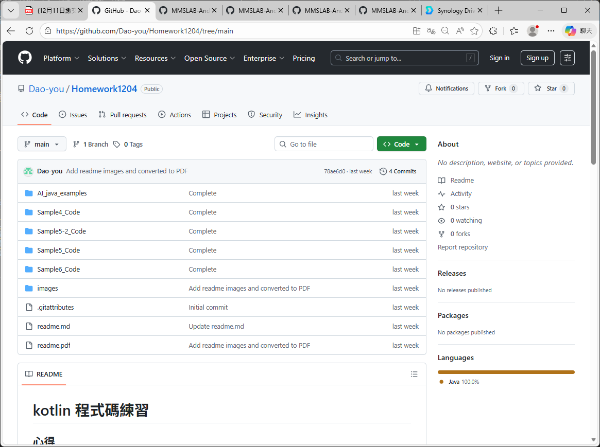
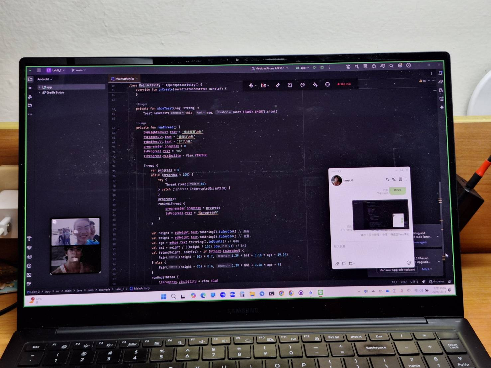

# kotlin 程式碼練習

## 心得

## Github

### 網址：
[https://github.com/Dao-you/Homework1211](https://github.com/Dao-you/Homework1211)

### 截圖：

# 讀書會

* 組員：方宇澤
* 討論時間：2025/12/03 19:00 ~ 20:00
* 地點：LINE 通話
* 討論主題：Java 類別技巧與問題討論、複習 Android XML 設計工具、討論期末專題方向

